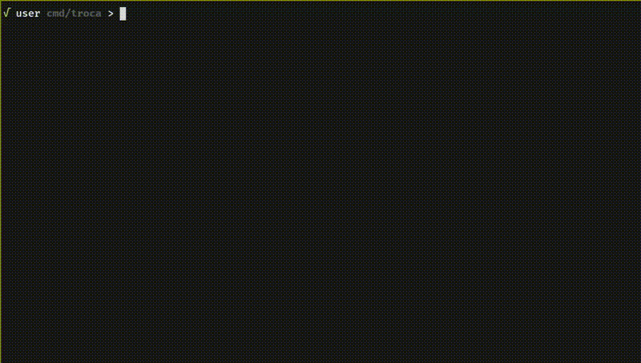

# SWAP | The Crypto Swap Terminal

> Exchange crypto assets cross-chain leveraging multiple Decentralized Exchanges (DEX).

## Features

- multi-dex support for best rates
- cross-chain swaps (wallet to wallet)
- privacy-focused: your IP is not sent to exchanges
- simple navigation (esc go back / enter go forward)
- securely save/load your wallets (sha256/hmac)
- search dozens of assets
- swap or pay (floating/fixed)
- QR code support
- open source
- no logs stored anywhere
- SSH-app (WIP: coming soon)

## Demo

<a href="https://swapcli.com/asset/demo.mp4">
  
</a>

_Click the image above to view the video_

## Installation

> download from [Github Releases](https://github.com/lfaoro/swap/releases) \
> OS: Linux, MacOS, Windows \
> Arch: x86_64, arm64

### Bash one-liner

```bash
curl -sSL https://get.swapcli.com | bash
```

### Go install

```bash
go install github.com/lfaoro/swap/cmd/swap@latest
```

### MacOS (brew)

```bash
brew install lfaoro/tap/swap
```

### Nix (coming soon)

```bash
nix-env -iA swap
```

### Build

> requires [Go](https://go.dev/doc/install)

```bash
git clone https://github.com/lfaoro/swap.git \
&& cd swap \
&& make build \
&& bin/swap
```

## Storage

- GNU/Linux / MacOS `$HOME/.config/swap/config`
- Windows `%AppData%/swap/config`

## Remote Access

```bash
ssh swap@ssh.swapcli.com #(WIP: coming soon)
``` 

## Contributing

I love pull requests, don't hesitate.

## Support

- [GitHub issues](https://github.com/lfaoro/swap/issues)
- [Telegram Chat](https://t.me/swapcli)

## Help swap grow

> With your help, we can make swap better.

- **Star the repo**
- Tell your friends
- [FIAT Donation](https://checkout.revolut.com/pay/7c8fae59-f65b-44de-9875-39dc014dc817)
- [Sponsor](https://github.com/sponsors/lfaoro)
- XMR donation [**9XCyahmZiQgcVwjrSZTcJepPqCxZgMqwbABvzPKVpzC7gi8URDme8H6UThpCqX69y5i1aA81AKq57Wynjovy7g4K9MeY5c**]
- BTC donation [**bc1qzaqeqwklaq86uz8h2lww87qwfpnyh9fveyh3hs**]

## Roadmap

- [ ] implement auto clipboard
- [ ] implement birdpay feature
- [ ] create stylish themes

## Disclaimer

Swapcli.com provides a service (hereinafter referred to as "the Platform") that facilitates the swapping of crypto tokens by integrating third-party services. Please be aware of the following:

- **No Ownership or Custody**: I do not own, hold in custody, or control any of the crypto tokens that are exchanged. All transactions occur directly between users through external services.

- **Third-Party Services**: The Platform merely serves as an interface to external services for token transfers. I am not responsible for the execution, security, or performance of these third-party services.

- **Compliance**: While I strive to maintain compliance with EU regulations, users are personally responsible for adhering to local laws, including tax obligations, anti-money laundering (AML) regulations, and know your customer (KYC) requirements where applicable.

- **Risks Inherent in Crypto Transactions**: Cryptocurrency investments and transactions involve significant risks, such as price volatility, security breaches, and regulatory changes. Users should conduct thorough research and understand these risks before engaging with the Platform.

- **No Financial Advice**: The Platform does not provide financial, legal, or tax advice. Users should consult with professionals for such guidance.

- **Liability Limitation**: I disclaim any liability for any losses, damages, or costs arising from the use or inability to use the Platform, including but not limited to loss of profits, goodwill, or any other intangible losses, to the maximum extent permitted by law.

- **Commission**: A commission is charged on each transaction facilitated through the Platform, solely for the use of the interface. This does not imply involvement in the actual transfer of tokens.

- **Regulatory Changes**: The regulatory environment for cryptocurrencies is rapidly evolving, particularly with the implementation of the EU's MiCA regulation. I will attempt to adapt to these changes, but cannot guarantee uninterrupted service or that all aspects of the service will remain compliant under new regulations.

- **Indemnification**: By using this Platform, you agree to indemnify, defend, and hold harmless Leonardo Faoro from and against any claims, liabilities, damages, losses, and expenses, including legal fees, arising from your use of the services or your violation of this disclaimer.

- **Use at Your Own Risk**: All users engage with the Platform at their own risk.

**By using this service, you acknowledge that you have read, understood, and agreed to this disclaimer and the associated risks.**
